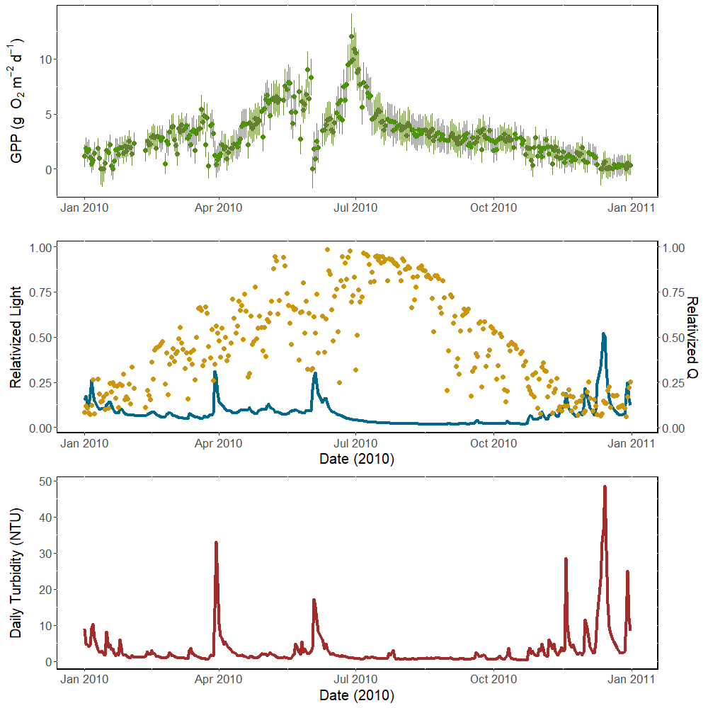
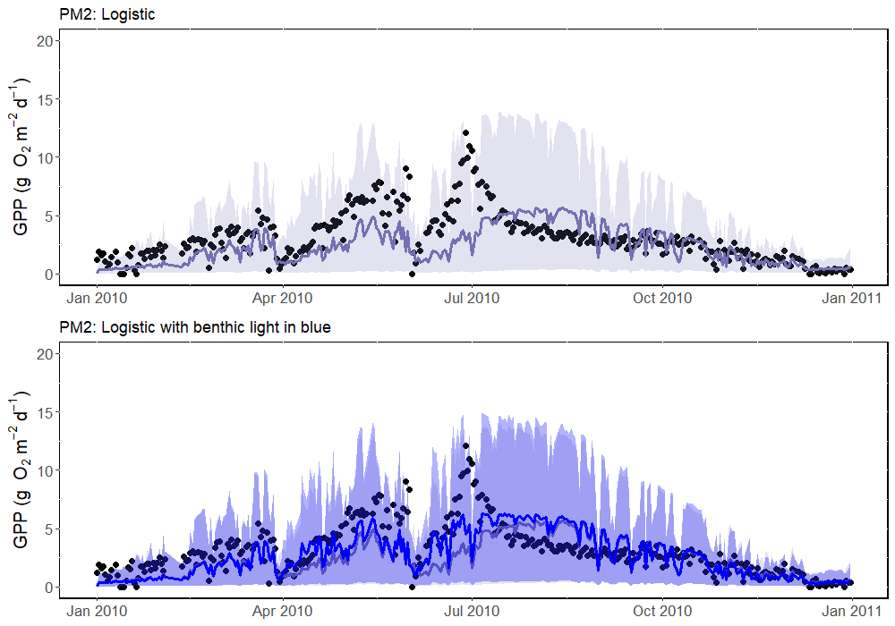
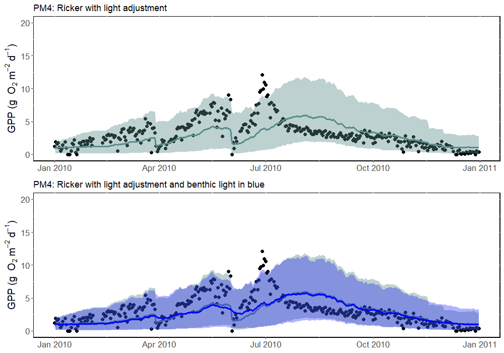
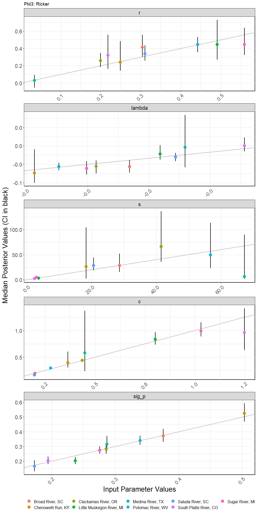

This document is an overview of the progress thus far on modeling productivity dynamics in rivers. All code and data is available at this Github page: https://github.com/jrblaszczak/RiverBiomass

##### Methods Overview
We estimated productivity dynamics in rivers through time with five stochastic state-space models that account for process and observation error. We fit each model to annual time series of oxygen-derived daily gross primary productivity (GPP) rates. The first model is phenomenological, meaning it does not infer causality, but instead approximates lags through an autoregressive parameter, a positive correlative relationship between GPP and light indicative of autotrophic biomass growth, and a negative relationship between GPP and discharge indicative of autotrophic biomass loss. The next four models are semi-mechanistic, meaning they are meant to represent the mechanisms by which productivity rates may increase or decrease through time through the growth and detachment of autotrophic biomass. Therefore, these four models include a latent variable "biomass" meant to represent the amount of autotrophic biomass contributing to the diel variation in the dissolved oxygen signal from which daily GPP is estimated. The semi-mechanistic models differ in the structure of the equation meant to represent biomass growth dynamics, but share a similar disturbance component, both of which are described below.

We selected a subset of river metabolism time series from 356 rivers with daily estimates of metabolism generated using the streamMetabolizer package in R by the US Geological Survey Powell Center (Appling et al. 2018b). Daily metabolism estimates were generated using a hierarchical state-space inverse modeling approach with partial-pooling of piece-wise $K_{600}$ relationships with mean daily discharge ($Q$) to reduce issues of equifinality and uncertainty (Appling et al. 2018a). Daily metabolism and gas exchange estimates were generated from sub-daily time series of dissolved oxygen (units: $mg$ $L^{-1}$), light (photosynthetic photon flux density (PPFD); units: $\mu mol\ m^{-2}\ s^{-1}$), water temperature ($^\circ$ C), and reach averaged depth (m). A Bayesian Markov chain Monte Carlo (MCMC) fitting procedure was used to determine the mean and standard deviation of the posterior probability distributions of daily gross primary productivity (GPP; $g\ O_{2}\ m^{-2}\ d^{-1}$),  ecosystem respiration (ER; $g\ O_{2}\ m^{-2}\ d^{-1}$), and gas exchange ($K_{600}$; $d^{-1}$). In this study, we treat the mean and standard deviation of the daily GPP estimates from each river as "data" in the state-space models described below.

**There are three sections to this document:**

1. Written descriptions of each model.

2. Figures comparing model simulations using the posterior predictives from each model using incoming light, and a second version of the same model which has another parameter to attempt estmation of benthic light after accounting for attenuation from turbidity. All models are fit to GPP time series from 2010 in the Clackamas River, Oregon. Links to each stan file and each simulation function are included. This section also includes a comparison of the daily RMSE among models (DIC comparison forthcoming).

3. Simulations from posteriors and parameter recovery for the Ricker Model without benthic light adjustments across nine rivers. The selection of rivers was a relatively random subset to this point (sites with >350 with clear visual decline in GPP in response to a storm), but I think a more interesting comparison will be to choose ~10 river years with different flow regimes to demonstrate where and when the models work best.

##### References

Appling, A.P., Hall, R.O., Yackulic, C.B. & Arroita, M. (2018a). Overcoming equifinality: Leveraging long time series for stream metabolism estimation. J. Geophys. Res. Biogeosciences, 123, 624-645.

Appling, A.P., Read, J.S., Winslow, L.A., Arroita, M., Bernhardt, E.S., Griffiths, N.A., et al. (2018b). The metabolic regimes of 356 rivers in the United States. Sci. Data, 5, 180292.


## 1. Model descriptions

### Productivity Model 1: Linear autoregressive model

We first predict the temporal dynamics of daily estimates of GPP ($g$) using a linear autoregressive model without latent biomass dynamics. We fit the model to the $g$ times series from Appling et al. (2018a) to estimate the parameters described below:

\begin{equation} 
G_{t} \sim N(\phi G_{(t-\Delta t)}+\alpha L_{t}+\beta Q_{t}, \sigma_{proc})
\end{equation}

\begin{equation} 
g_{t} \sim N(e^{G_{t}},\sigma_{obs})
\end{equation}

where input data includes the daily mean of the posterior probability distribution of previously modeled daily GPP time series ($GPP_{mod,t}$; $g\ O_{2}\ m^{-2}\ d^{-1}$), $L$ which is daily light at time $t$ relativized to the annual maximum daily light (unitless; 0<$L$<1), and $Q_t$ which is daily discharge at time $t$ relativized to the annual maximum daily discharge (unitless; 0<$Q$<1). Light and discharge were relativized to the annual maximum as opposed to zero to avoid switching between positive and negative values. Estimated parameters include $G_{t}$ which is the predicted daily GPP (g $O_2$ $m^{-2}$ $d^{-1}$) at time $t$ (in days) on a log scale, $\phi$ which is the estimated autoregressive parameter (unitless; 0<$\phi$<1), $\alpha$ which is a light use efficiency parameter of log GPP growth per unit relativized light, $\beta$ which is a loss parameter of log GPP loss per unit relativized discharge, $\sigma_{obs}$ which is the observation error set to the standard deviation of the posterior probability distribution of the previously modeled daily GPP estimates ($g$), $\sigma_{proc}$ which is the process error. 

For the benthic light version of this model, $L_t$ is replaced by $benL_t$ in Lambert's law:

\begin{equation}
benL_{t} = L_{t}e^{(-1 \times a \times T_{t} D_{t})}
\end{equation}

where $a$ is an esimated parameter to estimate the downwelling light attenuation coefficient ($K_d = a \times T_{t}$), $T_t$ is daily turbidity (NTU), and $D_t$ is daily depth (m) from Appling et al. (2018b).

Stan code (surface light): https://github.com/jrblaszczak/RiverBiomass/blob/main/code/Stan_ProductivityModel1_Autoregressive.stan

Stan code (benthic light): https://github.com/jrblaszczak/RiverBiomass/blob/main/code/Stan_ProductivityModel1_Autoregressive_BenthicL.stan

Simulation code (surface and benthic light): https://github.com/jrblaszczak/RiverBiomass/blob/main/code/Simulated_ProductivityModel1_Autoregressive.R


### Productivity Model 2: Latent biomass logistic growth
We predict the temporal dynamics of mean daily estimates of GPP ($g$) by incorporating biomass as a latent variable and modeling its dynamics using a logistic growth model. We fit the model to the $g$ times series from Appling et al. (2018b) to estimate the model parameters. We incorporated the effects of disturbance by modeling the persistence ($P$) of biomass using a complementary log-log link function of the form:

\begin{equation}
    P_{t} = e^{-e^{s*(Q_{t} - c)}}
\end{equation}

where input data includes $Q_t$ which is daily discharge at time $t$ relativized to the annual maximum. Estimated parameters include $s$ which is a parameter that characterizes the steepness of the persistence transition and $c$ is an estimated parameter which approximates the critical discharge at which autotrophic biomass is disturbed. The log-log link function constrains values between 0 and 1, where 0 is no persistence and 1 is complete persistence.

Together, the full model took the form:

\begin{equation}
    B_{t} \sim N(P_{t}(B_{(t-\triangle t)} e^{r_{max}B_{(t-\triangle t)}(1-\frac{B_{(t-\triangle t)}}{K})}), \sigma_{proc})
\end{equation}

\begin{equation}
    g_{t} \sim N(L_{t} e^{B_{t}}, \sigma_{obs})
\end{equation}


where estimated parameters include $B_{t}$ which is a latent variable representative of photosynthetically-active biomass on a log scale and daily time step, $P_{t}$ which is the daily persistence of biomass dependent on hydrologic disturbance and removal detailed above, $K$ which is the estimated carrying capacity of a river, $r_{max}$ is the maximum per capita growth rate when $\frac {B_t}{K}$ approaches zero following a disturbance, $\alpha$ which is a light growth efficiency parameter (units: g $O_2$ $m^{-2}$ $d^{-1}$), and $\sigma_{proc}$ which is the process error. Input data and the benthic light substitution are detailed above in PM1.

Stan code (surface light): https://github.com/jrblaszczak/RiverBiomass/blob/main/code/Stan_ProductivityModel2_Logistic.stan

Stan code (benthic light): https://github.com/jrblaszczak/RiverBiomass/blob/main/code/Stan_ProductivityModel2_Logistic_BenthicL.stan

Simulation code (surface and benthic light): https://github.com/jrblaszczak/RiverBiomass/blob/main/code/Simulated_ProductivityModel2_Logistic.R


### Productivity Model 3: Latent biomass Ricker model
We predict the temporal dynamics of mean daily estimates of GPP ($g$) by incorporating biomass as a latent variable and modeling its dynamics using a Ricker growth model. We fit the model to the $g$ times series from Appling et al. (2018) to estimate the model parameters. We incorporated the effects of disturbance by modeling the persistence ($P$) of log biomass using a complementary log-log link function of the same form as above.

Here we use the Ricker model to model the discrete time step dynamics of log biomass ($B_t$), but we start with the original form with biomass ($b_t$):

\begin{equation}
    b_{t} = b_{(t-\Delta t)}e^{r_{max}(1-\frac{b_{(t-\Delta t)}}{K})}
\end{equation}

Then if we take the log of both sides of the equation and multiply $r_{max}$ through,

\begin{equation}
    log(b_{t}) = log(b_{(t-\Delta t)})+r_{max}-\frac{r_{max}b_{(t-\Delta t)}}{K}
\end{equation}

Next, if we substitute $B_t = log(b_t)$ and $\lambda = \frac{-r_{max}}{K}$, then we arrive at the final form used here:

\begin{equation}
    B_{t} \sim N(P_{t}(B_{(t-\Delta t)} + r_{max} + \lambda e^{B_{(t-\Delta t)}}), \sigma_{proc})
\end{equation}

\begin{equation}
    g_{t} \sim N(L_{t}e^{B_{t}},\sigma_{obs})
\end{equation}


where estimated parameters include $B_{t}$ which is a latent variable representative of photosynthetically-active biomass on a natural log scale and daily time step, $P_{t}$ which is the daily persistence of biomass dependent on hydrologic disturbance and removal detailed above, $K$ which is the estimated carrying capacity of a river, $r_{max}$ is the maximum per capita growth rate when $\frac {B_t}{K}$ approaches zero following a disturbance, $\sigma_{obs}$ which is the observation error set to the standard deviation of the posterior probability distribution of the previously modeled daily GPP estimates ($g$), $\sigma_{proc}$ which is the process error. Input data and the benthic light substitution are detailed above in PM1.

Stan code (surface light): https://github.com/jrblaszczak/RiverBiomass/blob/main/code/Stan_ProductivityModel3_Ricker.stan

Stan code (benthic light): https://github.com/jrblaszczak/RiverBiomass/blob/main/code/Stan_ProductivityModel3_Ricker_BenthicL.stan

Simulation code (surface and benthic light): https://github.com/jrblaszczak/RiverBiomass/blob/main/code/Simulated_ProductivityModel3_Ricker.R


### Productivity Model 4: Latent biomass Ricker model with light adjustment
We test a modification of the Ricker model (PM3) in which light is incorporated into the estimation of maximum growth rate $r_{max}$:

\begin{equation}
    B_{t} \sim N(P_{t}(B_{(t-\Delta t)} + r_{max,t} + \gamma e^{(B_{(t-\Delta t)})}), \sigma_{proc})
\end{equation}

\begin{equation}
    r_{max,t} = \alpha_{1}L_{t}
\end{equation}

\begin{equation}
    g_{t} \sim N(e^{B_{t}},\sigma_{obs})
\end{equation}


where estimated parameters, input data, and benthic light are the same as in PM3 detailed above, except for $\alpha_1$ which is a light use efficiency parameter describing log biomass growth per unit light.

Stan code (surface light): https://github.com/jrblaszczak/RiverBiomass/blob/main/code/Stan_ProductivityModel4_Ricker_lightadj.stan

Stan code (benthic light): https://github.com/jrblaszczak/RiverBiomass/blob/main/code/Stan_ProductivityModel4_Ricker_lightadj_BenthicL.stan

Simulation code (surface and benthic light): https://github.com/jrblaszczak/RiverBiomass/blob/main/code/Simulated_ProductivityModel4_Ricker_lightadj.R


### Productivity Model 5: Gompertz
We predict the temporal dynamics of mean daily estimates of GPP ($g$) by incorporating biomass as a latent variable and modeling its dynamics using a Gompertz growth model. We fit the model to the $g$ times series from Appling et al. (2018) to estimate the model parameters. We incorporated the effects of disturbance by modeling the persistence ($P$) of biomass using a complementary log-log link function of the same form as above.

Here we use the Gompertz model where biomass is on a log scale detailed in:

Ives, A.R., Dennis, B., Cottingham, K.L. & Carpenter, S.R. (2003). Estimating community stability and ecological interactions from time-series data. Ecol. Monogr., 73, 301-330.

We add light as a covariate to the model to describe growth:

\begin{equation}
    B_{t} \sim N(P_{t}(\beta_{0} + \beta_{1}e^{(B_{(t-\Delta t)})} + \beta_{2}L_{t}), \sigma_{proc})
\end{equation}


\begin{equation}
    g_{t} \sim N(e^{B_{t}},\sigma_{obs})
\end{equation}


where estimated parameters include $B_{t}$ which is a latent variable representative of photosynthetically-active biomass on a natural log scale and daily time step, $P_{t}$ which is the daily persistence of biomass dependent on hydrologic disturbance and removal detailed above, $\beta_0$ which is the intrinsic rate of increase, $\beta_1$ governs the strength of density dependence, $\beta_2$ which is a light use efficiency parameter, $\sigma_{obs}$ which is the observation error set to the standard deviation of the posterior probability distribution of the previously modeled daily GPP estimates ($g$), and $\sigma_{proc}$ which is the process error. Input data and the benthic light substitution are detailed above in PM1.

Stan code (surface light): https://github.com/jrblaszczak/RiverBiomass/blob/main/code/Stan_ProductivityModel5_Gompertz.stan

Stan code (benthic light): https://github.com/jrblaszczak/RiverBiomass/blob/main/code/Stan_ProductivityModel5_Gompertz_BenthicL.stan

Simulation code (surface and benthic light): https://github.com/jrblaszczak/RiverBiomass/blob/main/code/Simulated_ProductivityModel5_Gompertz.R


## 2. Model simulation comparisons

Model simulations using matrices of the posterior predictives for the Clackamas River, Oregon in 2010

```{r}

knitr::include_graphics("../figures/PM1_simulations.png")

knitr::include_graphics("../figures/PM3_simulations.png")

knitr::include_graphics("../figures/PM5_simulations.png")
```

Below is a comparison of the distributions of daily RMSE values across models without the additional benthic light parameter.

```{r}
knitr::include_graphics("../figures/OR_dailyRMSE_comparison.png")
```


## 3. Model comparison across 9 rivers

The Ricker model without any light modification appeared to perform the best, despite the slightly lower daily RMSE for the light adjusted Ricker model. I applied this model across 10 rivers, but removed one from the following figures because of what appeared to be data issues. However, in future comparisons among rivers, I'm going to try choosing a couple of rivers across a range of flow regimes. I don't want to go too crazy with that though, because I think it should be another paper to really expand beyond the initial set chosen for this paper.

Map of chosen rivers
```{r}

```

Parameter recovery
```{r}

```

Persistence across discharge for the nine rivers


